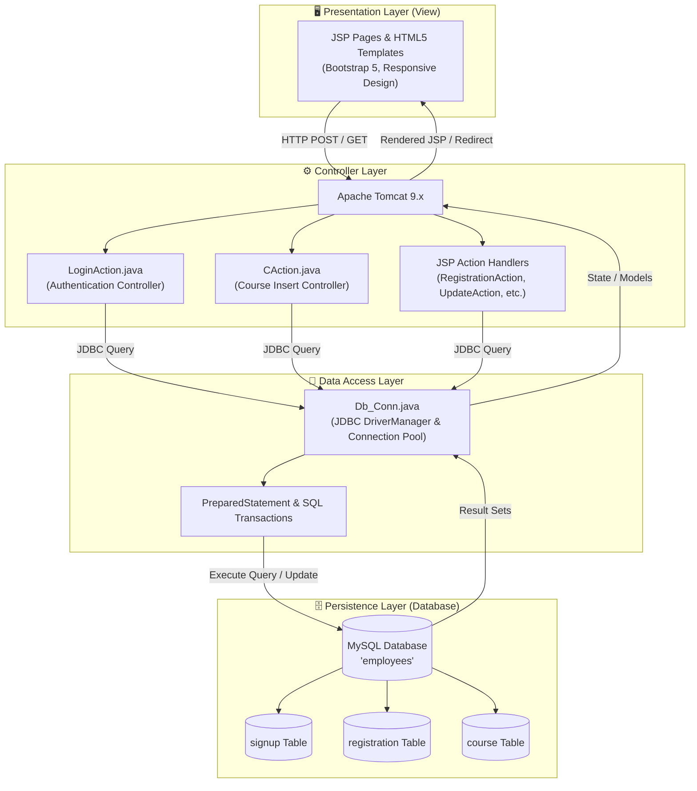

<div align="center">

# 🎓 E-Tutorial — Learning Management & Course Portal

[](https://www.oracle.com/java/)
[](https://jakarta.ee/)
[](https://www.mysql.com/)
[](https://tomcat.apache.org/)
[](https://getbootstrap.com/)
[](LICENSE)

<p align="center">
  <b>A full-featured Enterprise Web Application built on Java (JSP/Servlet), JDBC, and MySQL architecture for IT training institutes, online course registration, student management, and academic administration.</b>
</p>

[Explore Features](#-key-features) •
[System Architecture](#-system-architecture) •
[Database Setup](#-database-schema--setup) •
[Installation Guide](#-installation--setup) •
[Endpoint Directory](#-application-routing--endpoints) •
[Contributing](#-author--credits)

</div>

---

## 📌 Executive Summary

**E-Tutorial** is an enterprise-grade academic portal designed to automate student admissions, technical course delivery, and administrative record-keeping. The platform bridges the gap between prospective learners and training institutes by providing seamless online course registration, role-based authentication, and a centralized administrative dashboard.

Developed strictly following the classic **Model-View-Controller (MVC Architecture)** using Core/Advance Java, Servlets, JSP scriptlets/directives, and native JDBC connection pooling.

---

## 🚀 Key Features

### 👨‍🎓 Student & Learner Portal
* **Course Catalog:** Explore technical courses (Java, Python, C/C++, PHP, C#, Android, Big Data/Hadoop, Node.js) with detailed durations, syllabi, and fee schedules.
* **Online Admission System:** Self-service registration form collecting student demographic, regional branch, and course selection data.
* **Account Lifecycle:** User registration (`Signup.jsp`), secure session-based authentication (`login.jsp`), and forgotten credential recovery workflow.
* **Student Dashboard:** Dedicated student workspace upon successful login.

### 🛡️ Administrative Portal
* **Role-Based Authentication:** Protected administrative session preventing unauthorized access to backend management tools.
* **Student Roster Management (Full CRUD):**
  * View all registered candidate submissions in real-time.
  * Update student details (Course, Branch, Phone, Address, Zipcode).
  * Purge/Delete inactive student registrations with immediate database synchronization.
* **Curriculum Management (Full CRUD):**
  * Create and publish course offerings with custom pricing, durations, and project types (Mini/Major).
  * Modify existing curriculum modules and update fee structures dynamically.
  * Remove deprecated course listings.

---

## 🏛️ System Architecture

The application implements a clean **Model-View-Controller (MVC)** design pattern:



---

## 🛠️ Technology Stack Breakdown

| Layer | Component | Specification |
| :--- | :--- | :--- |
| **Language** | Java Standard Edition | JDK 8 / JDK 11 / JDK 17 |
| **Server & Container** | Apache Tomcat | Versions 8.5, 9.0+ |
| **Controllers** | Java Servlets | Jakarta / Java EE Servlet 3.0+ (`@WebServlet` annotations) |
| **View Technology** | JavaServer Pages | JSP 2.3 with JSTL & EL capabilities |
| **Database Connector**| JDBC Connector/J | `mysql-connector-java-8.0.11.jar` |
| **RDBMS** | MySQL Server | MySQL Community Server 8.0+ |
| **Frontend Framework**| Responsive UI | Bootstrap 5, CSS3, JavaScript ES6, Bootstrap Icons |
| **UI Base Theme** | Mentor Theme | Designed by BootstrapMade |

---

## 🗄️ Database Schema & Setup

### 1. Database Creation
Execute the following script in MySQL Workbench or MySQL CLI:

```sql
CREATE DATABASE IF NOT EXISTS employees;
USE employees;
```

### 2. Table Specifications

#### 🔹 `signup` Table (User Accounts)
Stores user credentials and profile details for student authentication.
```sql
CREATE TABLE IF NOT EXISTS signup (
    id INT AUTO_INCREMENT PRIMARY KEY,
    user VARCHAR(100) NOT NULL,
    password VARCHAR(100) NOT NULL,
    fname VARCHAR(100),
    email VARCHAR(150) UNIQUE NOT NULL,
    phone VARCHAR(20),
    state VARCHAR(50),
    address TEXT,
    gender VARCHAR(10),
    created_at TIMESTAMP DEFAULT CURRENT_TIMESTAMP
);
```

#### 🔹 `registration` Table (Course Admissions)
Captures student applications and course enrollment entries.
```sql
CREATE TABLE IF NOT EXISTS registration (
    id INT AUTO_INCREMENT PRIMARY KEY,
    name VARCHAR(100) NOT NULL,
    phone VARCHAR(20) NOT NULL,
    email VARCHAR(150) NOT NULL,
    branch VARCHAR(100) NOT NULL,
    course VARCHAR(100) NOT NULL,
    amount VARCHAR(50) NOT NULL,
    address TEXT NOT NULL,
    city VARCHAR(100) NOT NULL,
    country VARCHAR(100) NOT NULL,
    zipcode VARCHAR(20) NOT NULL,
    registered_at TIMESTAMP DEFAULT CURRENT_TIMESTAMP
);
```

#### 🔹 `course` Table (Academic Offerings)
Maintains the catalog of technical courses managed by administrators.
```sql
CREATE TABLE IF NOT EXISTS course (
    id INT AUTO_INCREMENT PRIMARY KEY,
    course VARCHAR(100) NOT NULL,
    description TEXT,
    fees VARCHAR(50),
    duration VARCHAR(50),
    project VARCHAR(50),
    password VARCHAR(100)
);
```

---

## ⚙️ Configuration & Connection

Configure your local MySQL database credentials in:  
📁 [`src/main/java/Conn/Db_Conn.java`](src/main/java/Conn/Db_Conn.java)

```java
package Conn;

import java.sql.Connection;
import java.sql.DriverManager;

public class Db_Conn {
    public static final String Driver = "com.mysql.cj.jdbc.Driver"; // Recommended for MySQL 8+
    public static Connection con;
    public static final String url = "jdbc:mysql://localhost:3306/";
    public static final String username = "root";
    public static final String password = "YOUR_DATABASE_PASSWORD"; // <-- Update here
    public static final String database = "employees";

    public static Connection getCon() {
        try {
            Class.forName(Driver);
            con = DriverManager.getConnection(url + database, username, password);
        } catch (Exception e) {
            e.printStackTrace();
            return null;
        }
        return con;
    }
}
```

---

## 🚦 Application Routing & Endpoints

| URL Pattern / File | Method | Access Level | Description |
| :--- | :---: | :---: | :--- |
| `/index.jsp` | `GET` | Public | Main landing page highlighting services & trainers |
| `/courses.jsp` | `GET` | Public | Comprehensive course listing |
| `/RegistrationForm.jsp` | `GET` | Public | Interactive online course admission form |
| `/admin/RegistrationAction.jsp` | `POST` | Public | Processes student admission and writes to `registration` table |
| `/login.jsp` | `GET` | Public | Authentication gateway for students and administrator |
| `/LoginAction` | `POST` | Public | Servlet routing users: Admin ➔ `/admin/AdminHome.jsp`, Student ➔ `/Student/StudentHome.jsp` |
| `/Signup.jsp` | `GET/POST`| Public | New user registration |
| `/ForgetPassword.jsp` | `GET` | Public | Form for credential recovery |
| `/ForgetPasswordAction.jsp` | `POST` | Public | Updates user password upon matching credentials |
| `/admin/AdminHome.jsp` | `GET` | Admin | Administrative landing overview |
| `/admin/RegistrationStudent.jsp`| `GET`| Admin | Tabular listing of all student applications |
| `/admin/update_res.jsp` | `GET` | Admin | Edit candidate registration information |
| `/admin/delete_res.jsp` | `GET` | Admin | Deletes specific registration record |
| `/admin/C.jsp` | `GET` | Admin | Course creation interface |
| `/admin/cAction.jsp` / `/CAction`| `POST` | Admin | Persists new course entity to the database |

---

## 💻 Installation & Setup

### Prerequisites
1. **Java Development Kit (JDK):** Version 8 or higher ([Download](https://www.oracle.com/java/technologies/downloads/)).
2. **Web Container:** Apache Tomcat 8.5, 9.0, or 10.1 ([Download](https://tomcat.apache.org/)).
3. **Database Server:** MySQL Community Server 8.0+ ([Download](https://dev.mysql.com/downloads/mysql/)).
4. **IDE:** Eclipse IDE for Enterprise Java and Web Developers, IntelliJ IDEA Ultimate, or NetBeans.

### Step-by-Step Deployment:

1. **Clone the Repository:**
   ```bash
   git clone https://github.com/Anand9899/E-Tutorial-.git
   ```

2. **Database Initialization:**
   - Start your MySQL server.
   - Run the provided [SQL DDL Scripts](#-database-schema--setup).

3. **Import into Eclipse:**
   - Go to `File` ➔ `Import...` ➔ `General` ➔ `Existing Projects into Workspace`.
   - Browse and select the project directory, then click **Finish**.

4. **Verify Dependencies & Build Path:**
   - Confirm that `mysql-connector-java-8.0.11.jar` is available under `src/main/webapp/WEB-INF/lib/`.
   - Right-click project ➔ `Build Path` ➔ `Configure Build Path` ➔ Ensure Apache Tomcat Runtime and JRE System Library are attached.

5. **Deploy & Run on Server:**
   - Right-click project ➔ `Run As` ➔ `Run on Server`.
   - Select Apache Tomcat v9.0 and finish.
   - Navigate to your browser:
     ```
     http://localhost:8080/E-Tutorial/index.jsp
     ```

---

## 🔐 Credentials Cheat-Sheet

| Role | Interface URL | Username / Email | Default Password |
| :--- | :--- | :--- | :--- |
| **Administrator** | `/login.jsp` | `admin@gmail.com` | `admin` |
| **Student** | `/login.jsp` | *(User's Registered Email)* | *(User's Registered Password)* |

---

## 📁 Repository Structure

```
E-Tutorial/
├── .gitignore                          # Git exclusions (build, class files)
├── README.md                           # Enterprise documentation
├── src/
│   └── main/
│       ├── java/
│       │   ├── Com/
│       │   │   └── Servlet/
│       │   │       ├── CAction.java         # Course creation servlet controller
│       │   │       └── LoginAction.java     # Authentication controller
│       │   └── Conn/
│       │       └── Db_Conn.java             # Database connection singleton / utility
│       └── webapp/
│           ├── assets/                      # Vendor libraries, vendor CSS/JS, images
│           ├── css/                         # Custom stylesheets & Bootstrap CSS
│           ├── js/                          # Application scripts & Bootstrap JS
│           ├── admin/                       # Admin Portal Components
│           │   ├── AdminHome.jsp            # Admin dashboard
│           │   ├── AdminNavbar.jsp          # Sidenav with language links
│           │   ├── RegistrationStudent.jsp  # Student records table (CRUD)
│           │   ├── update_res.jsp           # Update student record UI
│           │   ├── UpdateAction_Res.jsp     # Update student record processor
│           │   ├── delete_res.jsp           # Student record deletion
│           │   ├── C.jsp, C++.jsp, java.jsp # Language specific course forms
│           │   └── ...                      # Additional management endpoints
│           ├── Student/                     # Student Workspace
│           │   ├── StudentHome.jsp          # Student profile & dashboard
│           │   └── StudentNavbar.jsp        # Student navigation
│           ├── WEB-INF/
│           │   └── lib/
│           │       └── mysql-connector-java-8.0.11.jar # JDBC Driver
│           ├── index.jsp                    # Public homepage
│           ├── login.jsp                    # Login view
│           ├── Signup.jsp                   # Account registration view
│           ├── RegistrationForm.jsp         # Course admission application
│           ├── ForgetPassword.jsp           # Password recovery
│           └── Navbar.jsp, Footer.jsp       # Reusable layout partials
```

---

## 👨‍💻 Author & Credits

* **Developer:** [Anand Kumar Mishra](https://github.com/Anand9899)
* **GitHub Repository:** [Anand9899/E-Tutorial-](https://github.com/Anand9899/E-Tutorial-)
* **UI Theme Credit:** [Mentor Bootstrap Theme](https://bootstrapmade.com/mentor-free-education-bootstrap-theme/) by BootstrapMade.

---

<div align="center">
  <sub>Built with ❤️ using Java Servlets, JSP & MySQL. If this project helped you, don't forget to star ⭐ the repository!</sub>
</div>
